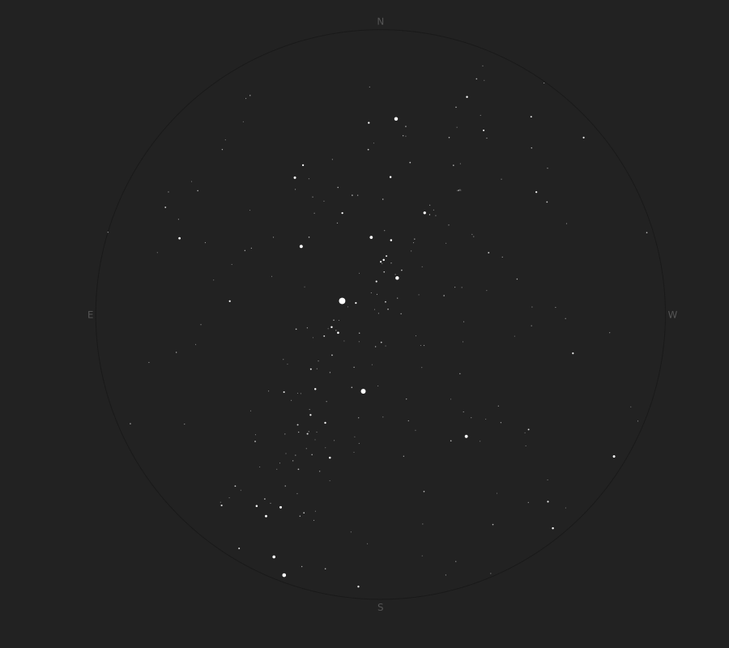

# CelestialCalc

[](https://github.com/pedrosbmartins/CelestialCalc.jl/blob/main/LICENSE)
[](https://pedrosbmartins.github.io/CelestialCalc.jl/dev)

A package that implements positional astronomy tools as described in the book [Celestial Calculations by J. L. Lawrence](https://celestialcalculations.github.io/).

CelestialCalc was created for (self-)educational purposes and its main goal is teaching myself positional astronomy in more depth. The package is made available as open source for anyone interested in amateur computational astronomy. Keep in mind that Julia already has some astronomy packages (many of them under the [JuliaAstro](https://juliaastro.org/dev/index.html) organization) that might be a better fit for serious use.

## Roadmap

This package is a work in progress. 

<details>
<summary>Current state (loosely following the book's outline)</summary>
  
- [ ] Time conversions
  - [x] LCT to UT
  - [ ] UT to LCT
  - [x] UT to GST
  - [ ] GST to UT
  - [x] GST to LST
  - [ ] LST to GST
- [ ] Coordinate Systems
  - [x] Equatorial
  - [x] Horizon
  - [ ] Ecliptic
  - [ ] Galactic
  - [ ] Precession and other corrections
- [ ] Stars
  - [x] Equatorial to horizon coordinates
  - [ ] Rising and setting times
  - [x] Star maps
- [ ] Sun
- [ ] Moon
- [ ] Solar System
- [ ] Satellites

</details>

## Examples

### Finding horizon coordinates for a star

Given a star's equatorial coordinates (e.g. Betelgeuse in J2000) and an observer's local date/time and position,
find the object's horizon coordinates.

```julia
using CelestialCalc, Dates, TimeZones

# equatorial coordinates for Betelgeuse in J2000
eq = EquatorialCoordinates(α=Time(5,55,10),δ=Angle(7,24,24))

# observer's local date/time and position
datetime = ZonedDateTime(2024,1,5,20,tz"UTC-3")
location = LatLng(-22.9068,-43.1729)

# local horizon coordinates
hz = equatorial_to_horizon(eq, datetime, location)
# HorizonCoordinates h=39°00'34.33'' Az=58°30'24.15''
```

### Plotting a star map

```julia
using CelestialCalc, TimeZones, Plots

# load the Bright Star catalog
brightstars = brightstars_catalog()

# define observer's date/time and position
date = ZonedDateTime(2024,1,2,22,45,tz"UTC-3")
latlng = LatLng(-22.9068, -43.1729)

# convert the equatorial coordinates of the catalog to the observer's horizon coordinates
brightstars_horizon = [Star(equatorial_to_horizon(star.coordinates, date, latlng), star.magnitude) for star in brightstars]

# filter only above-horizon stars within a certain magnitude
filter!(s -> s.coordinates.h >= 0 && s.magnitude <= 4.0, brightstars_horizon)

# create the star map
plot(brightstars_horizon; size=(900,800), colormode=:dark)
```



## Credits

- Logo is the [Orbit icon created by Creative Stall Premium - Flaticon](https://www.flaticon.com/free-icons/orbit).
